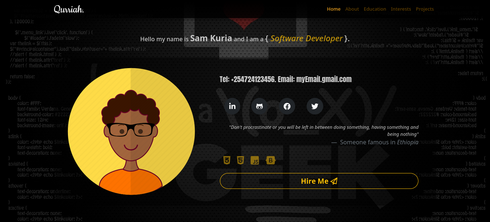

# Portfolio_Landing_Page

## Table of Content

- [Description](#description)
- [Technology Used](#technology-used)
- [Reference](#reference)
- [Licence](#licence)
- [Authors Info](#author-Info)

## Description

This portfolio website provides a showcase for HTML, CSS, JS, and Bootstrap technologies, offering a visually stunning and informative platform for displaying information about its creator. With its intuitive and easy-to-navigate design, the website presents a range of impressive features and examples of its creator's skills, including projects, accomplishments, and professional experience.

### Screenshot

### Requirements

- Either a computer, smartphone, tablet or an Ipad.

- Internet Access.

[Go Back to the top](#Portfolio_Landing_Page)

## Technology

- Semantic HTML5 Markup - Has been used to build the structure of the page.

- CSS Custom properties - Has been used to style the landing page.

- JavaScript - Has been used to create the business logic.

- Bootstrap - Has been used for styling the navbar and other elements on the landingpage.

### Links

- Live Site URL: [Portfolio](https://qurriahsam.github.io/portfolioLandingPage/)

- Figma Design Link: [Figma](https://www.figma.com/file/rDXDFBQRNPS02SeRFbaULh/portfolio?node-id=0%3A1)

[Go Back to the top](#Portfolio_Landing_Page)

## License

[MIT](./LICENSE) License

[Go Back to the top](#Portfolio_Landing_Page)

## Authors Info

Linked - [Sam Kuria](https://www.linkedin.com/in/sam-kuria-0904b01a1)

[Go Back to the top](#Portfolio_Landing_Page)
